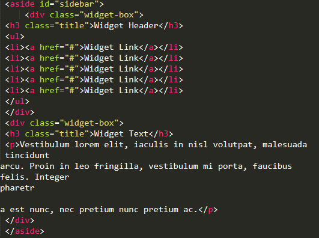

# Praktikum Pemprograman Web
Nama : Komarudin

NIM : 312010068

Kelas : TI.20.D.1

## Belajar Membuat CSS Layout
### Langkah-langkah Praktikum

Membuat Dokumen HTML dengan nama file <b>lab4_box.html</b>

  

### Membuat Box Element.

  

### CSS Float Property

  

Kemudian buka browser untuk melihat hasilnya

  

### Mengatur Clearfix Element

  <b>Clearfix</b> digunakan untuk mengatur element setelah float element. Property <b>clear</b> digunakan untuk mengaturnya.Tambahkan element div lainnya setelah div3 seperti berikut.

  

Kemudian atur property clear pada CSS.

  

Selanjutnya buka buka browser dan refresh kembali.

  

### Membuat Layout Sederhana.

  Buat folder baru dengan nama <b>lab4_layout</b>,kemudian buatlah file baru didalamnya dengan nama <b>home.html</b> dan file css dengan nama <b>style.css</b>

   )

   

Kemudian buka browser dan lihat hasilnya.

   

Kemudian tambahkan kode CSS untuk membuat layoutnya.

   

Kemudian lihat hasilnya pada browser.

   

### Membuat Navigasi

Kemudian selanjutnya mengatur navigasi.

   

Kemudian lihat hasilnya.

   

### Membuat Hero Panel.

Selanjutnya membuat hero panel.Tambahkan kode HTML dan CSS seperti berikut.

   

   

   

### Mengatur Layout Main dan Sidebar.

Selanjutnya mengatur main content dan sidebar,tambahkan CSS float.

   

### Membuat Sidebar Widget.

   

Kemudian tambahkan CSS.

   

   

### Mengatur Footer

Selanjutnya mengatur tampilan footer.Tambahkan CSS untuk footer.

   

   

### Menambahkan Elemen lainnya pada Main Content

   

Kemudian tambahkan CSS.

   

   

Lihat hasilnya dibrowser.

   

### Menambahkan Content Artikel

Selanjutnya membuat content artikel.Tambahkan HTML berikut pada main conten.

   

Kemudian tambahkan CSS.

   

   

## Tugas

### 1. Tambahkan Layout untuk menu About

   

### 2. Tambahkan Layout untuk menu Contact

   

